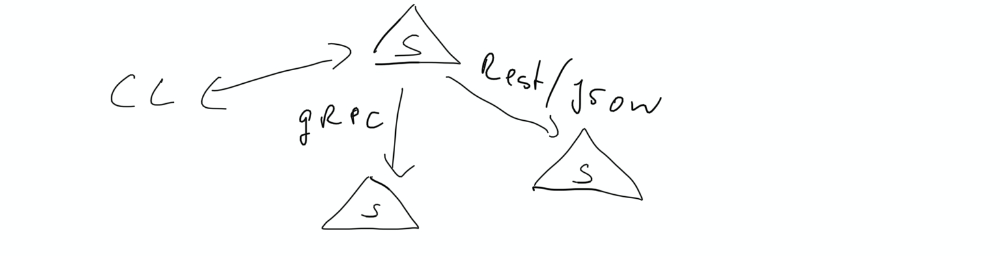

# The Document Transformation Application

The Document Transformation Application (DTA) is a microservice based web service application provided by the research group QDS of the TU Berlin.

The DTA serves as a playground for different research topics and provides a collection of different document transformation functions. A DocumentTransformationFunction DTF transforms a document into another document. Transforming in our context is meant in a very broad sense. Actually the semantics defined is, that one document, represented as a byte array, is passed as a argument to the DTF and another array of bytes is returned.

## The DTA Server protocol

The  protocol between a [DTA user](#user-content-dtauser) and the [DTA Server](#user-content-dtaserver) is defined using [gRPC](https://grpc.io/) and we call it [DTA Server Protocol](#user-content-thedtaserverprotocol). A [DTA worker](#user-content-dtaworker) might also act as a gateway to

The server protocol is defined using [gRPC](https://grpc.io) and consists of three operations

- TransformDocument
- ListServices
- TransformPipe
  
We have build the protocol using the [protobuf v3.9.1](https://github.com/protocolbuffers/protobuf/releases/tag/v3.9.1) tool.

In addition we have defined a compatible RESTfull/JSON based API according to the following [REST specification](swagger/index.html)

## Architecture

The architecture is pretty simple as shown in



A Client communicates with a DTA Server via gRPC or RESTfull/JSON. The DTA Server can communicate with other DTA Servers and will return the result to the DTA client.

If a DTA server simply enables the communication with other, potentially private DTA servers we call this a DTA gateway.

## Implementations

Currently the project provides implementations for the following elements

### Servers

- [Gateway](gateway/README.md)
  A simple, straigth forward gateway implementation

### Services

- [Count](services/qds_count/README.md)
  Counting lines, words, bytes in a document

- [Echo](services/qds_echo/README.md)
  Just echoing the provided document

- [Html2text](services/qds_echo/README.md)
  Extracts from a HTML document the text in markdown form. Preserves table structures. 

## Installation of Implementations

Installation is pretty straight forward if you have a working golang environment.

```shell
go get github.com/theovassiliou/doctrans
go build ./...
go test ./...
```

If the output looks reasonable you are ready to go.

## 1st run

To test run a client/server pair try out the following

```shell
go run services/qds_echo/echo.go
```

and in another terminal on the same host

```shell
go run clients/client.go test/testDoc.txt
```

`client` sends the file `testDoc.txt` to the *echo* server which has been started before. Addressing is hardcoded via the default parameters.

If you start in a third terminal on the same host an additional server with

```shell
go run services/qds_count/count.go
```

This would start the *count* server, listening on the next available port. In order to use this service you could use now

```shell
go run clients/client.go -g :50052 test/testDoc.txt
```

For detailed configurations consult the respective client and server READMEs

## Glossary

- DTA  - Document Transformation Application
  - DTA client - Synonym for DTA user.
  - DTA gateway - A DTA gateway offers via the DTA server API access to non-publicly available DTA
  - DTA server - The DTA server provides an API for document transformation. The DTA server might use [DTA worker](#user-content-dtaworker) to perform the task, or other means. See also DTA Gateway
  - DTA server protocol - The protocol between DTA server and DTA user.
  - DTA user - Is a entity that uses the DTA Server API to transform a document. Also called DTA client.
  - DTA worker - A microservice providing *one* transformation function, potentially parametrised. A DTA worker is also a DTA server.
  - DTF - Document Transformation Function is a function that tranforms a document into another document. Simple example include, ECHO (the null transformation) or COUNT (Counting lines, words and/or characters), while more suffistacted functions might convert a PDF to a text document.
