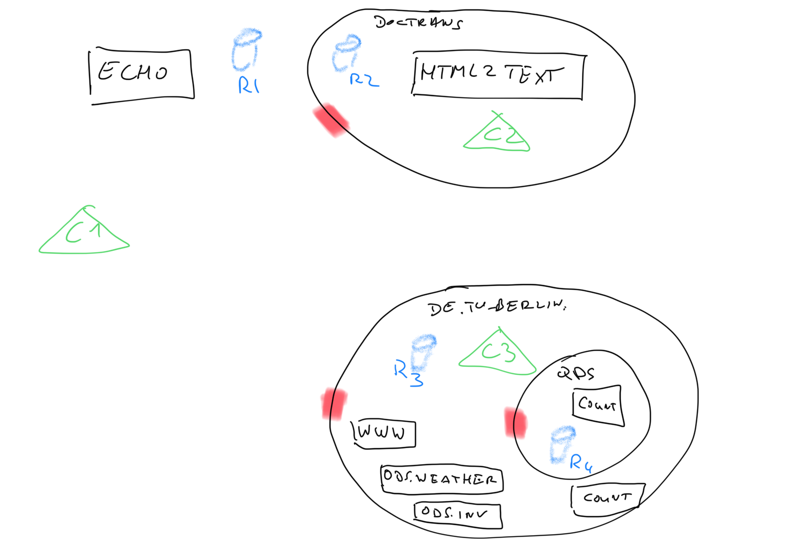
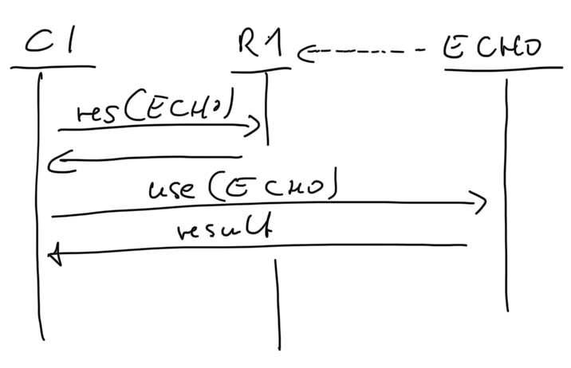
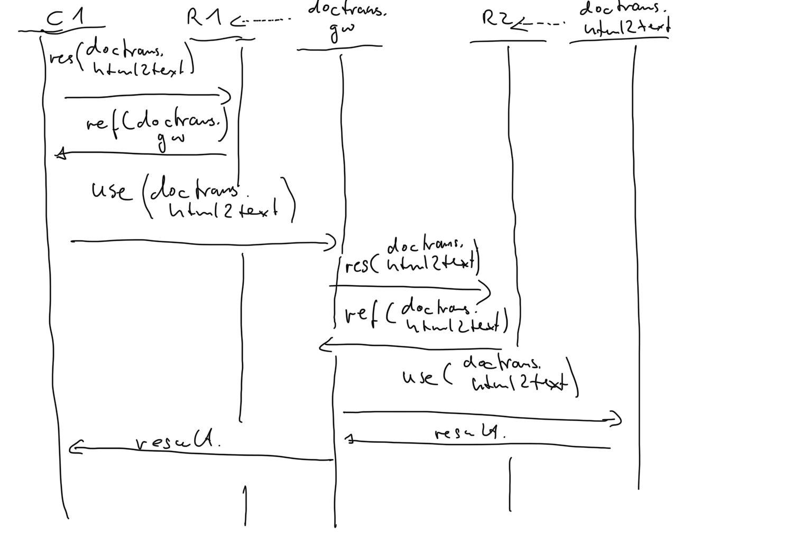
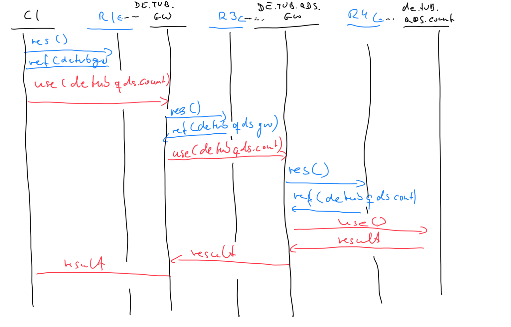

# Das Universum, Galaxien, Systeme und Services

## Einleitung

Das Document Application Transformation [DTA](../../doctrans/README.md) definiert die Interaktion von Services zur Erbringung von Dokumentationtransformationen.

Diese Services werden mit Hilfen von (unqualifierten) *Servicenamen* identifiziert. Alle Services befinden sich in einem *Universum.

*Services* können müssen aber nicht in *Galaxien* gruppiert werden. Sie können sich auch frei im *Universum* befinden.
*Galaxien* wiederum können weitere *Galaxien* enthalten. Eine Ansammlung von *Services*, die einen gemeinsamen Namensprefix haben und sich in der selben *Galaxie* befinden, wird *System* genannt. *Systeme* können, müssen aber nicht ebenso wie *Services* sich in *Galaxien* befinden.

Wie man unschwer erkennen kann, bildet die *Galaxien* im Universum eine Art Hierarchie zur Gruppoerierung und Identifizierung von Services.

## Beispiel

Nehmen wir zum Beispiel den Service *DE.TU-BERLIN.QDS.ECHO*. Die Aufgabe dieses hypotethischen Dienstes ist es ein Dokument unverändert an seinen Sender zurückzusenden.

Der *Servicename* lautet *ECHO*. Der Präfix *DE.TU-BERLIN.QDS* ist Pfad auf dem der *Service* von einem Clienten erreicht werden kann. Den einzelnen Bestandteilen des Präfix ist nicht anzusehen, ob sie _keine_, _eine_ oder _mehrere_ (Unter-)Galaxien identifizieren. Des weiteren kann man den Bestandteilen nicht entnehmen, ob ein eventueller *Systemname* existiert und falls ja, ob er aus _einem_ (*QDS*), _zwei_ (*TU-BERLIN.QDS*) oder _drei_ (*DE.TU-BERLIN.QDS*) Elementen besteht. Da ein *System* keine *Galaxie* und auch kein weitere *System* enthalten kann, eine *Galaxie* aber sehr wohl ein *System*, können ein/mehrere *Galaxien* den Präfix der Bestandteile darstellen, und ein mögliches *System* den Suffix.

## Was unterscheidet nun eine Galaxie von einem System

Wie bereits erläutert bilden *Galaxien* eine hierarchische Ordnung während *Systeme* lediglich eine logische Zusammenfassung von *Services* darstellen. *Galaxien* könenn *Galaxien*, *Systeme* oder *Services* enthalten, *Systeme* gruppieren präfixgleiche *Services*.

Die Wegefindung (routing) von einer Galaxie in eine enthaltene Galaxie findet mittels *Wurmlöcher* (*Gateways*) statt. Ein *Client* nutzt ein *Wurmloch* um *Services* innerhalb einer Galaxies zu erreichen. Die Nutzung des *Wurmlochs* ist API kompatible zu den *Services*. Für die Diensterbringung lt. API routet das *Gateway* die Dienstanforderung entsprechend der Routingrichtlinien, und liefert das Ergebniss an den *Clienten* zurück. Selbstverständlich kann der *Client* auch ein anderes *Gateway* sein. Aus sicht des *Gateways* ist das Transparent.

## Technische Implementierung / Routing

Zur Diskussion des Routingalgorithmus gehen wir von folgenden examplarischen Univerum aus.



Das Universum kennt

- 7 Services (echo, html2text, www, ods.weather, ods.inv, ods.count, count)
- 3 Galaxien (doctrans, de.tu-berlin, qds)
- jede Galaxie hat ihr Wurmloch

| Objekt |Name | FQN |
| ---- | ---- | ---- |
| Galaxies | doctrans | doctrans |
| Galaxies | de.tu-berlin | de.tu-berlin |
| Galaxies | QDS | de.tu-berlin.qds |

Man kann der Tabelle entnehmen, dass eine Galaxie (`tu-berlin`) auch Präfixe benutzen kann, aber nicht muss. `doctrans` z.B. verwendet kein Präfix. Der Präfix im FQN von `qds` (`de.tu-berlin`) ergibt sich aus der Einbettung von `qds` in `de.tu-berlin.de`. Eine *Galaxie* kann in einer anderen *Galaxie* eingebettet sein, und wird auch *Subgalaxie* genannt. Wir verwenden aber den Begriff *Galaxie* sowohl für Galaxien und Subgalaxien, ausser in den Fällen in denen die Unterscheidung von Bedeutung ist.

| Objekt |Name | FQN |
| ---- | ---- | ---- |
| doctrans-Wurmloch | gw | doctrans.gw |
| de.tu-berlin-Wurmloch | gw | de.tu-berlin.gw |
| de.tu-berlin.qds-Wurmloch | gw | de.tu-berlin.qds.gw |

*Wurmlöcher* könne zwar auch beliebige Namen haben, aus Vereinfachungsgründen nennen wir unsere *Wurmlöcher* aber alle `gw`. Durch die Vollqualifiezierung des Namens durch die Galaxsieshierarchie sind sie eindeutig identifizierbar. Vorteil der globalen Festlegung auf einen (nicht-qualifiziert) Wurmlochnamen ist, dass *Services* und *Wurmlöcher* gemeinsamen in einer untypisierten Datenbank (siehe `Registry`, weiter unten) verwaltet können. Nachteil ist, dass der Wurmlochname, nicht erneut verwendet werden kann.

| Objekt |Name | FQN |
| ---- | ---- | ---- |
| Service | echo | echo |
| Service | html2text | doctrans.html2text |
| Service | wwww | de.tu-berlin.www |
| Service | count | de.tu-berlin.count |
| Service | ods.weather | de.tu-berlin.ods.weather |
| Service | ods.inv | de.tu-berlin.ods.inv |
| Service | count | de.tu-berlin.qds.count |

*Services* müssen innerhalb einer Galaxieebene eindeutige Namnen haben, z.B `ods.weather`, `ods.inv`. Ausserhalb einer Galaxie können Services aber den gleichen Namen haben, z.B. count in `de.tu-berlin` und `count` in `qds`. Durch die Vollqualifzierung des Namens durch die Galaxieshierarchie sind sie eindeutig identifzierbar (`de.tu-berlin.count` bzw. `de.tu-berlin.qds.count`). Die Dienste `weather` und `inv` sind hier im System `ods` zusammengefasst. Das *System* ods wiederum befindet sich in der Galaxies `de.tu-berlin`.

Neben den Dienstobjekten *Wurmloch* und *Services*, und den strukturellen (Namens-)Elementen *Galaxies* und *System* besitzt jede Galaxie wie auch das globale *Universum* eine *Registry*. Auf jeder Hierarchieeben (Universum, Galaxies) verwaltet es die in dieser Ebende sichtbaren *Services* und *Wurmlöcher*.

Dabei gilt das jeder Service sich beim Registry seiner Galaxies anmeldet.

| Registry | Galaxie | Objekt | Name | Registrierter Name bei seinem Registry |
| --- | --- | --- | --- | --- |
| R1 | universe | Service | echo | echo |
| R1 | doctrans | Wurmloch | gw | doctrans.gw |
| R1 | de.tu-berlin | Wurmloch | gw | de.tu-berlin.gw |
| R2 | doctrans | Service | html2text | doctrans.html2text |
| R3 | de.tu-berlin | Service | www | de.tu-berlin.www |
| R3 | de.tu-berlin | Service | ods.weather | de.tu-berlin.ods.weather |
| R3 | de.tu-berlin | Service | ods.inv | de.tu-berlin.ods.inv |
| R3 | de.tu-berlin | Service | count | de.tu-berlin.count |
| R3 | de.tu-berlin.qds | Wurmloch | gw | de.tu-berlin.qds.gw |
| R4 | de.tu-berlin.qds | Service | count | de.tu-berlin.qds.count |

Am Beispiel der 3 Klienten `C1`, `C2` und `C3` möchten wir das Routing durch die Wurmlöcher erläutern
In den folgenden Szenarienfolgen wir den Dienstaufrufen durch das *Universum* um *Services* in den Galaxien `doctrans`, `de.tu-berlin` und `de.tu-berlin.qds` zu nutzen.

### C1

Der Client C1 befindet sich in keiner Galaxies sonder im globale *Universum* und möchte verschiedene Services nutzen. Initial kennt er lediglich die *Universums*-*Registry* R1.

Die Objekte im *Universum* können zur Diensterfüllung zwei Operation nutzen

```golang
    func (r Registry) resolve(name FQSN) (*Service, error)
    func (s Service) use(name FQSN) (document, error)
```

Die Operation `resolve` kann auf eine Registry angewendet werden, und liefert für ein Vollqualifizierten Namen einen Service, der diesen so referenzierten Service erbringen kann. Sollte der Dienst nicht auf einen Objekt aufgelöst werden können, so wird ein Fehler übergeben.

Die Operation `use` kann auf einen Service angewendet werden, benötigt einen vollqualifizierten Servicenamen und liefert das Serviceergebnis zurück. Sollte der Service nicht erbracht werden können, so wird ein Fehler zurückgegeben.

Da Wurmlöcher die Ooperation `user()` implementieren, sind sie in diesem Sinne ebenfalls Services.

#### C1 -> Echo



Bei der Nutzung des globalen Services `echo` kann die Registry R1 den `resolve()` direkt auflösen, in eine Referenz auf die *Serviceinstanz* zurück geliefert wird.

#### C1 -> doctrans.html2text

Befindet sich der gesuchte *Service* in einer Galaxie, so stellt sich die Nutzung des *Service* aus Klientensicht, der sich im globalen Universum befindet, zwar identisch dar. Jedoch sind mehr Objekte involviert.



Dee `resolve()` Anfrage kann in diesem Fall nicht mit der Serviceinstanz beantwortet werden. Vielmehr liefert die Registery (R1) unter folgenden Bedingungen die Instanz eines Wurmloches (doctrans.gw) zurück.
    1) Statische Vorbedingung: Die *Registry* weiss, dass ein Wurmloch *alle* Serviceanfragen für seinen Präfix erbringen kann.
    2) Dynamische Vorbedingung: Das Wurmloch hat sich mit seinem FQSN bei der *Registry* registriert.

Mithilfe der statischen Vorbedingung (und der Festlegung auf einen Wurmlochnamen) kann eine *Registry* wie folgt einen FQDSN zu einer Serviceinstanz auflösen.

```text
    1. Erstelle eine Liste aller FQSN in der Registry
    2. Entferne den Wurmlochnamen von allen Einträgen, so vorhanden. Referenzen auf Instanzen bleiben aber erhalten.
    3. Suche eine exakte Übereinstimmung des FQSN innerhalb der Registryeinträge.
        Bei exakter Übereinstimmung liefere die referenzierte Serviceinstanz. DONE.
    4. Kürze von hinten den FQSN um ein Element. Fahre bei 3. fort.
    5. Kann der FQSN nicht weiter gekürzt werden, breche die Suche ab. Die Registry kennt keine Instanz, die diese Serviceanfrage bearbeiten könnte
```

Da in diesem Fall der Service `doctrans.html2text` nicht 

#### C1 -> de.tu-berlin.qds.count



## Glossar

FQSN - Fully Qualified Service Name - Vollqualifierterter Service name.

## Namen

```BNF
<galaxy_name>   = <galaxy_name>+ | <galaxy_name> <system_name> | <empty>
<system_name>   = <qualifier> | <empty>
<qualified_name>= <qualifier> <name>
<service_name>  = <name>
<qualifier>     = <name>[.<name>]+.
<name>          = [A-Za-z0-9_]+`  
```
